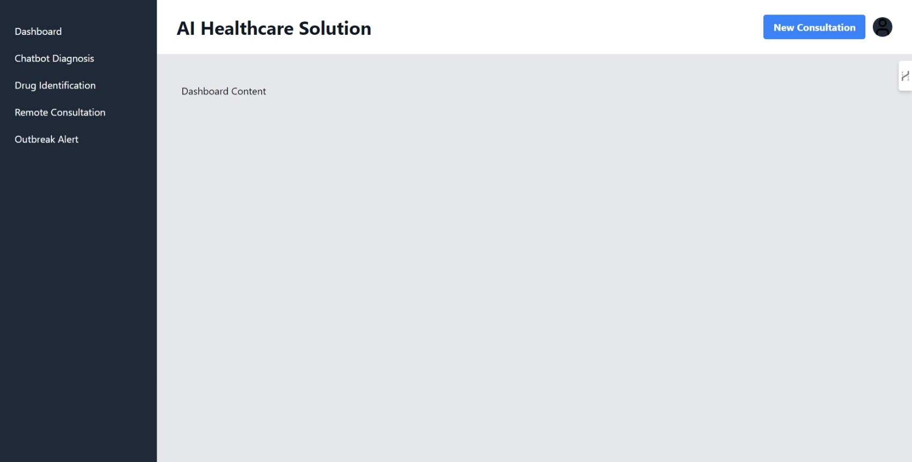

# AI Health Care Frontend using React

This React frontend provides a basic structure for our AI-driven remote healthcare solution.



Here's a breakdown of the components:

1. **App**: The main component that sets up routing and the overall layout.
2. **Sidebar**: Navigation menu for different sections of the application.
3. **Header**: Top bar with the application title and user menu.
4. **Placeholder components for each main feature**:
   - **Dashboard**
   - **Chatbot Diagnosis**
   - **Drug Identification**
   - **Remote Consultation**
   - **Outbreak Alert**

### Key features:
- Responsive design with a collapsible sidebar for mobile views.
- React Router for navigation between different sections.
- Tailwind CSS for styling.
- Lucide React icons for visual elements.

## To use this frontend:

1. Navigate to the `ai-healthcare-frontend` directory
```
cd frontend/ai-healthcare-frontend
```
2. Set up the development environment:
   - Ensure you have Node.js installed. If not, download and install it from https://nodejs.org/

3. Install necessary dependencies:
   ```powershell
   npm install react-router-dom lucide-react
   ```

4. Set up Tailwind CSS:
   ```powershell
   npm install -D tailwindcss@latest postcss@latest autoprefixer@latest
   npx tailwindcss init -p
   ```
5. Run the development server:   

   ```powershell
   npm start
   ```

Your default web browser should automatically open to `http://localhost:3000`, where you'll see your React app running.

## Troubleshooting:
- If you encounter any issues with missing dependencies, install them using `npm install [package-name]`.
- Make sure your PowerShell execution policy allows running scripts. You might need to run `Set-ExecutionPolicy RemoteSigned` in an administrator PowerShell.


## Next steps:
1. Implement the content for each placeholder component.
2. Connect the frontend to your Django backend API.
3. Implement state management (e.g., using Redux or React Context) for handling application-wide data.
4. Add more detailed styling and responsiveness to each component.
5. Implement user authentication and authorization.

## Development Workflow:
1. Keep the terminal in VS Code open with the development server running.
2. Edit your React components in `src/App.js` or create new component files in the `src` directory.
3. The page will automatically reload when you make changes.
4. Check the terminal for any error messages if the page doesn't update as expected.